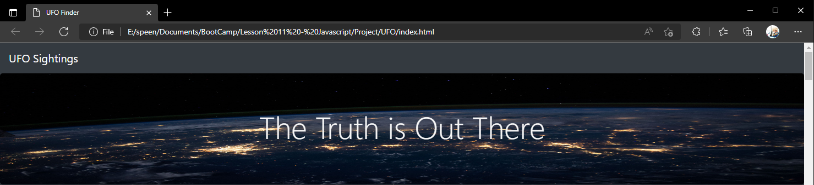
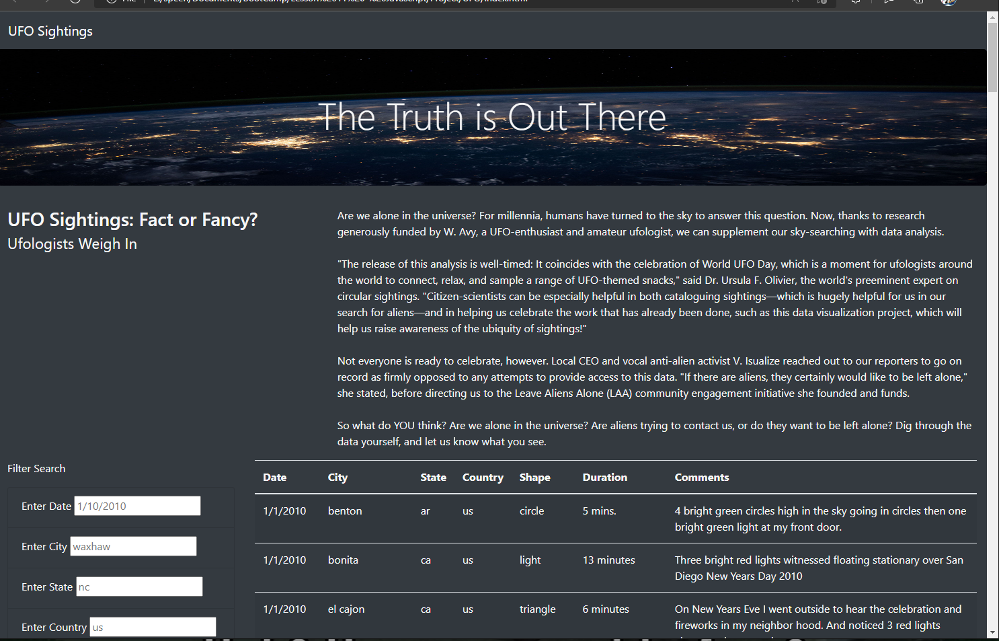
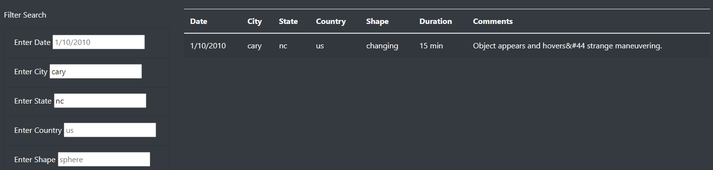
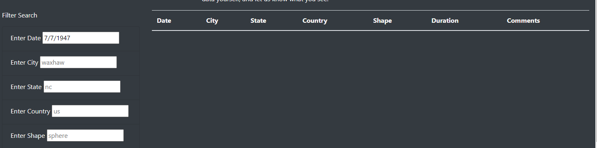

# UFO

## Overview
  Welcome to the UFO Sightings html templet. This templet has been put together at the request of our client Dana. She will be righting an article about her hometown McMinnville, Oregon and a UFO sighting that happened there years ago. The article will be posted on the web and to go with it Dana will be posting a list of UFO sightings that haven taken place all around North America. At her request, visitors will be able to filter the data in the table to find a specific area, date, or type of sighting. here is how the template will work for the user.
  
## Results
  ### Homepage
  
   
   
   When the user 1st loads the site, they will be granted by a header card and article at the top of the page. Above the header where it says UFO Sightings there is a navigation bar where Dana can out links to other webpages. Below the header users can find the articles title on the left and the main article on the right. At the bottom of the article the table with sit for the users to look up the data. the webpage is designed to display dynamically based on the user’s screen size and will automatically adjust to any changes.
   
   ### Filtering Data
   
   
   
   Using the group of textboxes on the left side of the screen users can filter the table to find what they are looking for. When entering the filters into box type in  the info as its shown in the preview text. 
   
   - Date: when entering date use a M/D/YYYY format.
   - Cities: enter in the city name. only use lowercase letters in this box.
   - State: Use the 2-letter code for the state you are looking up in lowercase.
   - Country: enter in a 2-letter code for the country in lowercase.
   - Shape: when entering in the desired shape use lowercase only.

  Once the filter has been entered simply hit enter on the keyboard or click out of the text box to update the table. Multiple filters can be used at the same to find the specific instance the user is looking for.
  
  ### Data Not Found
  
  
  When the user inters in a filter or combination of filters that yields no results the table appear blank as seen above. The User will need to double check that the filters are entered correctly. If the filters are correct then the data does not exist, remove the filters and enter in a new combination to look up.
  
 ## Summary
 
 The webpage should be quite simple for users to access. It has a simple layout that is easy to understand and navigate. There are some improvements that can be made before the definitive version is implemented.
 
 ### Issues
  The biggest issue with the web page is the user input for the filters. User inputs are too rigid to figure out and there are only basic examples to guide them. the date filter should be changed to except a range of date formats that can be converted to the M/D/YYYY format. Some formats to except should be MM/DD/YYYY with leading zeroes and MM/DD/YY for years beyond 2000. another change to be made would be to add a start and end date to make it easier to search through the table rather than day by day. All the other fields should remove the current case sensitivity involved. Names and abbreviations are usually capitalized and will result in struggles for some users. Simply converting any capital into a lowercase should be an easy fix to ease the user experience.
  
 ### Improvements
  Beyond the issue with the filters there are some general improvements that could help the user experience when accessing the page. The first improvement to add would be a suggestion box for the filters. When a user begins typing into the text boxes a list of recommendations based on unique values in that column could be displayed for the user to click and auto finish. This feature makes it easier on the user typing and shows them what data is in the table unlike the current version.
  
  For the second improvement I would put the table in its own container with a frozen header so it can always be seen and an independent scroll bar. Currently when scrolling down through the default entry you lose the filters and headers when they leave view and only a limited amount of data can be comfortably shown in the table. by putting it in its own free scrolling window you never lose the table controls, and more data can be displayed at a time since the user can easily scroll down to it without losing their place in the webpage
